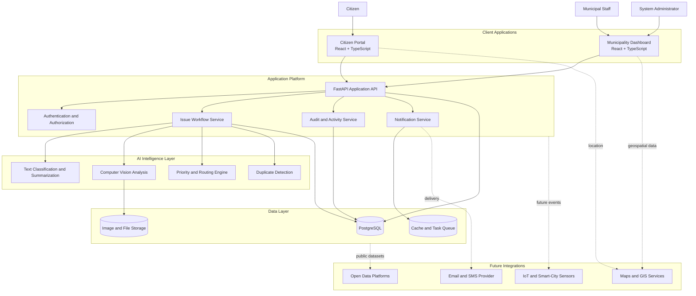
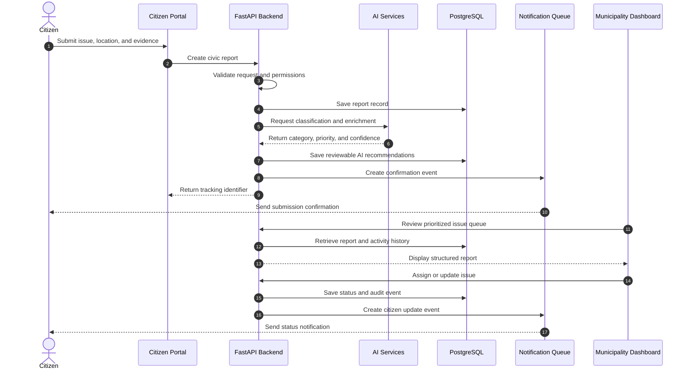

<div align="center">
<br />
<h1>CivicMind AI</h1>
<h3>AI-powered civic intelligence for faster, clearer, and more accountable cities.</h3>
<p>
  Transforming everyday civic reports into structured, prioritized, and actionable public-service intelligence.
</p>
<br />
<a href="#about-civicmind-ai">
  
</a>
<br />
<br />


<br />


<br />
<br />
<strong>
  <a href="#about-civicmind-ai">About</a>
  ·
  <a href="#features">Features</a>
  ·
  <a href="#architecture">Architecture</a>
  ·
  <a href="#technology-stack">Tech Stack</a>
  ·
  <a href="#project-structure">Structure</a>
  ·
  <a href="#roadmap">Roadmap</a>
  ·
  <a href="#contributing">Contributing</a>
</strong>
<br />
<br />
<p><strong>Mission:</strong> Make civic issue reporting intelligent, transparent, and actionable—from the first citizen report to the final municipal resolution.</p>
<br />
</div>

---
## About CivicMind AI
CivicMind AI is an intelligent civic engagement and infrastructure-management platform designed to improve how communities report, understand, prioritize, and resolve public issues.
It creates a shared digital workflow between citizens and municipal teams.
Citizens receive a clear way to report concerns such as road damage, broken streetlights, waste-management issues, water leakage, unsafe public spaces, accessibility barriers, and damaged public infrastructure.
Municipal teams receive structured information instead of fragmented emails, phone calls, images, social-media posts, and disconnected spreadsheets.
CivicMind AI converts civic reports into operational intelligence by combining:
- Artificial intelligence
- Computer vision
- Geospatial context
- Workflow automation
- Real-time status tracking
- Data analytics
- Modern web application architecture
> A civic complaint should not disappear into a queue. It should become a traceable, measurable, and actionable service request.
### Why it exists
Traditional civic-reporting systems may collect complaints, but they often fail to create a complete operational picture.
Important context is lost during manual handoffs. Locations may be incomplete. Images may be separated from descriptions. Urgency may be interpreted inconsistently. Citizens may receive no meaningful update after submission.
CivicMind AI is designed to bridge that gap and help public-service teams move from reactive complaint handling toward data-informed service delivery.
### Who it is built for
<table>
<tr>
<td width="25%" valign="top">
<h4>Citizens</h4>
<p>People who need a simple and transparent way to report community issues and follow their resolution.</p>
</td>
<td width="25%" valign="top">
<h4>Municipal Teams</h4>
<p>Departments responsible for reviewing, assigning, prioritizing, and resolving public-service requests.</p>
</td>
<td width="25%" valign="top">
<h4>City Leaders</h4>
<p>Decision-makers who need reliable civic data, service trends, and infrastructure insights.</p>
</td>
<td width="25%" valign="top">
<h4>Contributors</h4>
<p>Engineers, designers, researchers, and civic-technology professionals building public-interest software.</p>
</td>
</tr>
</table>

### Product principles
1. **Citizen-first simplicity** — reporting an issue should be fast, clear, and accessible.
2. **Operational usefulness** — every submission should help a municipal team make a decision.
3. **Transparent workflows** — citizens should understand what happens after submission.
4. **Responsible intelligence** — AI should support human judgment, not replace public accountability.
5. **Scalable architecture** — the platform should grow from a neighborhood pilot to a citywide system.
---
## The Problem
Civic infrastructure issues are visible everywhere, but the systems used to report and resolve them are often fragmented.
A damaged road, overflowing waste bin, broken streetlight, or unsafe sidewalk may be easy to observe and difficult to route through the correct authority.
### Slow manual reporting
Many reporting workflows still rely on:
- Phone calls
- General-purpose email inboxes
- Paper forms
- Department-specific portals
- Social-media messages
- Manually maintained spreadsheets
This creates delays before a report reaches the team capable of resolving it.
Important details may be lost, duplicated, or entered inconsistently during manual processing.
### Limited transparency
Citizens frequently receive little visibility after submitting a complaint.
Common questions remain unanswered:
- Was the report received?
- Which department owns it?
- Has anyone reviewed it?
- Is it a duplicate?
- When will action be taken?
- Has the issue been resolved?
Without meaningful status updates, public trust declines and duplicate submissions increase.
### Poor prioritization
Traditional queues often prioritize reports by submission time rather than public impact.
A cosmetic issue and a safety-critical infrastructure failure may enter the same workflow without consistent risk evaluation.
Municipal teams need stronger context to assess:

- Severity
- Safety impact
- Location sensitivity
- Number of affected residents
- Recurrence
- Nearby infrastructure
- Existing open reports
- Service-level urgency

### Limited analytics
When civic reports are stored across disconnected tools, cities cannot easily identify patterns.
They may struggle to determine:

- Which neighborhoods experience recurring infrastructure damage
- Which issue categories take the longest to resolve
- Where service demand is increasing
- Which departments face operational bottlenecks
- Whether seasonal trends affect infrastructure demand
- Which assets may require preventive maintenance

### Weak citizen-authority communication
Many reporting systems provide only one-directional communication.
A report is submitted, but there may be no clear feedback loop for progress updates, requests for additional details, or explanations of the final resolution.
The result is not only a workflow problem.
It is a trust problem.

---

## The Solution
CivicMind AI provides a unified civic-intelligence workflow that connects citizen reporting with municipal operations.
The platform captures high-quality information at the source, enriches it with AI, routes it intelligently, and preserves transparency throughout the issue lifecycle.
### Artificial intelligence
AI can transform free-form citizen submissions into structured service requests through:

- Issue classification
- Department recommendation
- Priority estimation
- Duplicate-report detection
- Description summarization
- Keyword extraction
- Urgency signals
- Resolution-note summarization
- Suggested operational next steps

AI-generated recommendations remain reviewable by authorized municipal users.
### Computer vision
Images often communicate infrastructure conditions more effectively than text alone.
Computer vision can assist with:

- Detecting visible infrastructure damage
- Identifying probable issue categories
- Estimating apparent severity
- Validating image relevance
- Supporting duplicate detection
- Comparing before-and-after evidence

The goal is not to make final decisions from an image. The goal is to help municipal teams review reports faster and more consistently.
### Data analytics
Structured civic data can reveal:

- Report volume
- Category trends
- Geographic hotspots
- Resolution times
- Department workload
- Recurring infrastructure failures
- Citizen engagement
- Service-level performance
- Seasonal patterns
- Long-term maintenance needs

### Automation
Routine workflow steps can be automated without removing human oversight:

- Acknowledge new reports
- Assign tracking identifiers
- Suggest responsible departments
- Flag possible duplicates
- Trigger status notifications
- Escalate overdue requests
- Request missing information
- Record audit events
- Generate operational summaries

### Modern web technologies
React and TypeScript support a responsive user experience. FastAPI provides a high-performance API foundation. PostgreSQL manages civic, user, workflow, and analytics-ready data.
AI services remain modular so models can evolve without tightly coupling intelligence logic to the user interface.

---

## Features
### Citizen Portal

- [x] Responsive civic-reporting experience
- [x] Guided issue-submission workflow
- [x] Category-based complaint reporting
- [x] Detailed issue descriptions
- [x] Image and evidence attachments
- [x] Location-aware submissions
- [x] Unique report tracking
- [x] Citizen-facing status timeline
- [x] Clear submission confirmation
- [ ] Saved report drafts
- [ ] Anonymous reporting controls
- [ ] Citizen feedback after resolution
- [ ] Expanded accessibility support

### Municipality Dashboard

- [x] Centralized report-management workspace
- [x] Searchable issue queue
- [x] Category, priority, status, and location filters
- [x] Detailed report review
- [x] Team assignment workflow
- [x] Issue-status management
- [x] Internal resolution notes
- [x] Evidence review
- [x] Activity history
- [ ] Department-specific workspaces
- [ ] Configurable service-level targets
- [ ] Bulk assignment actions
- [ ] Escalation workflows
- [ ] Supervisor review queues

### AI Engine

- [x] Modular AI-service architecture
- [ ] Natural-language issue classification
- [ ] AI-assisted category recommendation
- [ ] Priority and urgency scoring
- [ ] Duplicate-report detection
- [ ] Automatic description summarization
- [ ] Department-routing recommendation
- [ ] Visual issue recognition
- [ ] Image relevance validation
- [ ] Suggested response generation
- [ ] Human-review feedback loop
- [ ] Model-confidence visibility
- [ ] AI decision audit records

### Analytics

- [x] Analytics-ready data model
- [ ] Report-volume overview
- [ ] Issue-category distribution
- [ ] Geographic hotspot analysis
- [ ] Department workload trends
- [ ] Resolution-time tracking
- [ ] Open-versus-resolved trends
- [ ] Recurring-location analysis
- [ ] Service-level monitoring
- [ ] Exportable reports
- [ ] Leadership summary views
- [ ] Predictive maintenance indicators

### Authentication and Authorization

- [x] Role-aware application design
- [ ] Secure citizen authentication
- [ ] Municipal employee authentication
- [ ] Administrative access controls
- [ ] Role-based authorization
- [ ] Department-scoped permissions
- [ ] Protected API routes
- [ ] Session-management controls
- [ ] Account-verification workflow
- [ ] Optional single sign-on
- [ ] Fine-grained permission policies

### Notifications

- [x] Event-driven notification design
- [ ] Submission confirmation
- [ ] Assignment notification
- [ ] Status-change notification
- [ ] Resolution notification
- [ ] Request-for-information notification
- [ ] Escalation alerts
- [ ] Email notifications
- [ ] In-app notification center
- [ ] SMS integration
- [ ] Citizen notification preferences

### Maps and Geospatial Experience

- [x] Location-aware report model
- [ ] Interactive issue map
- [ ] Pin-based location selection
- [ ] Address search and geocoding
- [ ] Neighborhood and ward filters
- [ ] Heatmap visualization
- [ ] Nearby-report discovery
- [ ] Duplicate-location warnings
- [ ] Service-area overlays
- [ ] GIS dataset integration

### Future Expansion

- [ ] Mobile application
- [ ] Multilingual citizen experience
- [ ] Voice-assisted reporting
- [ ] IoT sensor integration
- [ ] Open-data publishing
- [ ] Public transparency dashboard
- [ ] Emergency-management workflows
- [ ] Contractor work orders
- [ ] Predictive infrastructure maintenance
- [ ] City-to-city benchmarking
- [ ] AI-powered decision support

---

## Architecture
CivicMind AI follows a modular architecture that separates user experience, domain logic, data management, intelligence services, and notification workflows.



### Report processing flow



### Architectural goals

- **Modularity** — major capabilities can evolve independently.
- **Traceability** — significant actions are recorded as auditable events.
- **Security** — access is enforced through authenticated, role-aware API boundaries.
- **Scalability** — asynchronous tasks can be separated from request-response operations.
- **Explainability** — AI recommendations can include confidence and supporting context.
- **Interoperability** — GIS, notification, and smart-city systems can be connected through adapters.
- **Maintainability** — frontend, backend, AI, data, and infrastructure concerns remain separated.

---

## Technology Stack

| Layer | Technologies | Responsibility |
|---|---|---|
| **Frontend** | React, TypeScript, Vite | Citizen portal and municipality dashboard |
| **Design System** | Tailwind CSS, reusable components | Responsive layouts and consistent interactions |
| **Backend** | FastAPI, Python, Pydantic | APIs, validation, workflows, and domain services |
| **Database** | PostgreSQL | Users, reports, assignments, history, and analytics-ready data |
| **Data Access** | SQLAlchemy, Alembic | Models, queries, and schema migrations |
| **AI — Language** | Python NLP services | Classification, summarization, routing, and urgency signals |
| **AI — Vision** | Computer-vision models | Evidence analysis and visible-damage detection |
| **Authentication** | JWT or standards-based identity | Secure identity, sessions, and role-based access |
| **Maps** | GIS and geocoding integration | Location capture and geographic analytics |
| **Storage** | Object storage | Images, attachments, and resolution evidence |
| **Notifications** | Email, SMS, and in-app adapters | Submission, assignment, status, and resolution updates |
| **Testing** | Pytest, Vitest, React Testing Library | Unit, integration, API, and interface testing |
| **Quality** | Ruff, Black, ESLint, Prettier | Code quality and consistent formatting |
| **Containers** | Docker, Docker Compose | Reproducible development environments |
| **Deployment — Future** | Managed containers, PostgreSQL, object storage | Secure and scalable cloud delivery |
| **Observability — Future** | Logs, metrics, tracing, error monitoring | Reliability and operational insight |

### Why this stack
**React and TypeScript** provide a maintainable component model for both citizen and municipal experiences.
**FastAPI and Python** support typed APIs, asynchronous operations, automatic documentation, and direct integration with AI services.
**PostgreSQL** provides relational consistency for reports, assignments, departments, users, status events, notifications, and geographic context.
**Tailwind CSS** supports a cohesive design system without coupling the interface to rigid page templates.

---

## Project Structure

```text
civicmind-ai/
│
├── frontend/
│   ├── public/
│   ├── src/
│   │   ├── app/
│   │   │   ├── providers/
│   │   │   ├── router/
│   │   │   └── store/
│   │   ├── components/
│   │   │   ├── common/
│   │   │   ├── forms/
│   │   │   ├── layout/
│   │   │   ├── maps/
│   │   │   └── ui/
│   │   ├── features/
│   │   │   ├── analytics/
│   │   │   ├── authentication/
│   │   │   ├── citizen-reports/
│   │   │   ├── municipality-dashboard/
│   │   │   └── notifications/
│   │   ├── hooks/
│   │   ├── lib/
│   │   ├── services/
│   │   ├── styles/
│   │   ├── types/
│   │   └── main.tsx
│   ├── tests/
│   ├── package.json
│   ├── tailwind.config.ts
│   └── vite.config.ts
│
├── backend/
│   ├── app/
│   │   ├── api/
│   │   │   ├── dependencies/
│   │   │   └── routes/
│   │   │       ├── analytics.py
│   │   │       ├── auth.py
│   │   │       ├── departments.py
│   │   │       ├── notifications.py
│   │   │       ├── reports.py
│   │   │       └── users.py
│   │   ├── core/
│   │   │   ├── config.py
│   │   │   ├── logging.py
│   │   │   ├── permissions.py
│   │   │   └── security.py
│   │   ├── db/
│   │   │   ├── models/
│   │   │   ├── repositories/
│   │   │   └── session.py
│   │   ├── schemas/
│   │   ├── services/
│   │   │   ├── analytics_service.py
│   │   │   ├── assignment_service.py
│   │   │   ├── audit_service.py
│   │   │   ├── notification_service.py
│   │   │   └── report_service.py
│   │   ├── workers/
│   │   └── main.py
│   ├── migrations/
│   ├── tests/
│   └── requirements.txt
│
├── ai/
│   ├── services/
│   │   ├── classification/
│   │   ├── computer_vision/
│   │   ├── duplicate_detection/
│   │   ├── prioritization/
│   │   └── summarization/
│   ├── evaluation/
│   ├── pipelines/
│   ├── prompts/
│   └── tests/
│
├── infrastructure/
│   ├── deployment/
│   ├── docker/
│   ├── monitoring/
│   └── scripts/
│
├── docs/
│   ├── api/
│   ├── architecture/
│   ├── decisions/
│   ├── product/
│   └── security/
│
├── .github/
│   ├── ISSUE_TEMPLATE/
│   ├── PULL_REQUEST_TEMPLATE.md
│   └── workflows/
│
├── .env.example
├── docker-compose.yml
├── LICENSE
└── README.md
```

### Structure philosophy
The repository separates user interfaces, APIs, domain services, AI capabilities, infrastructure, and documentation.
Frontend code is grouped by product domain. Backend code separates routes, schemas, business services, data access, and security. AI services remain isolated so models can be evaluated and replaced independently.

---

## Development Status
CivicMind AI is **actively under development**.
The status view below communicates delivery focus and does not represent production service-level metrics.

```text
Backend API Foundation        ██████████  Foundation Established
Landing Experience            ██████████  Foundation Established
Data Model                     ████████░░  Active Development
Authentication                ██████░░░░  Active Development
Citizen Reporting Workflow    ██████░░░░  Active Development
Municipality Dashboard        ████░░░░░░  Active Development
Notification Workflows        ██░░░░░░░░  Planned Integration
AI Classification             ██░░░░░░░░  Planned Integration
Computer Vision               ░░░░░░░░░░  Planned
Advanced Analytics            ░░░░░░░░░░  Planned
```

### Current engineering priorities

1. Establish a secure and maintainable application foundation.
2. Complete the end-to-end civic-report lifecycle.
3. Build role-aware municipality operations.
4. Introduce transparent notification workflows.
5. Add AI capabilities behind human-review controls.
6. Expand geospatial and analytics functionality.

---

## Roadmap
### Completed

- [x] Define the product mission and civic-impact model
- [x] Establish the reference system architecture
- [x] Select the core technology stack
- [x] Define citizen and municipality workflows
- [x] Define the civic-report lifecycle
- [x] Establish an open-source documentation foundation

### In Progress

- [ ] Build the citizen issue-submission workflow
- [ ] Implement secure authentication and role-aware access
- [ ] Complete core report-management APIs
- [ ] Build the municipality issue queue
- [ ] Add assignment and status-history workflows
- [ ] Establish automated tests and quality gates

### Planned

- [ ] Add AI-assisted classification and prioritization
- [ ] Add computer-vision evidence analysis
- [ ] Add duplicate-report detection
- [ ] Add maps, geocoding, and issue heatmaps
- [ ] Add operational analytics dashboards
- [ ] Add configurable notifications
- [ ] Add multilingual support
- [ ] Add GIS and smart-city integrations
- [ ] Add predictive maintenance capabilities
- [ ] Add mobile application support

---

## Future Vision
CivicMind AI is designed as more than a complaint-management portal.
The long-term vision is a civic intelligence platform that helps communities understand infrastructure conditions before small issues become expensive failures.
### Predictive Infrastructure Maintenance
Historical reports, recurring locations, asset age, environmental conditions, and resolution patterns can support preventive maintenance strategies.
Instead of responding only after failure, cities can identify where intervention is likely to be needed.
### Smart City Analytics
Future dashboards can help leaders understand:

- Infrastructure reliability
- Service demand by neighborhood
- Department capacity
- Recurring public-safety concerns
- Seasonal operational patterns
- Equity in service response
- Long-term capital-planning signals

### Mobile Application
A mobile experience can provide camera-first reporting, automatic location detection, offline drafts, push notifications, voice-assisted descriptions, and nearby issue discovery.
### GIS Integration
GIS integration can connect public reports with roads, streetlights, parks, drainage systems, public buildings, utility zones, service districts, and planned maintenance projects.
This creates stronger context for routing, prioritization, and long-term planning.
### Multi-language Support
Future multilingual capabilities can include translated interfaces, language-aware submissions, AI-assisted translation, multilingual notifications, and consistent issue categorization across languages.
### IoT Integration
Smart-city sensors can complement citizen reports through streetlight monitoring, water-leak detection, waste-bin capacity data, air-quality monitoring, traffic sensors, and flood alerts.
Citizen observations and sensor signals can create a more complete view of infrastructure conditions.
### AI-powered Decision Support
Future intelligence capabilities may help municipal leaders evaluate:

- Which infrastructure issues are growing most quickly
- Which interventions have the greatest public impact
- Which neighborhoods experience recurring service gaps
- Which assets are likely to fail
- Which work queues require additional capacity
- Which resolution strategies are most effective

These capabilities should remain explainable, reviewable, and aligned with public accountability.

---

## Contributing
Contributions are welcome from developers, designers, data professionals, researchers, civic-technology practitioners, and public-service experts.
### Ways to contribute

- Improve citizen-reporting usability
- Build reusable interface components
- Strengthen API design
- Improve authentication and authorization
- Add tests
- Improve accessibility
- Build analytics views
- Improve map interactions
- Develop AI evaluation tools
- Improve documentation
- Review privacy and security controls
- Propose municipal workflow improvements

### Contribution workflow

1. Fork the repository.
2. Create a focused feature branch.
3. Make the smallest complete change that solves the problem.
4. Add or update tests.
5. Run formatting, linting, type checks, and tests.
6. Update documentation when behavior changes.
7. Open a pull request with clear context.

```bash
git checkout -b feat/clear-feature-name
```

### Branch naming

```text
feat/citizen-report-form
fix/report-status-validation
docs/architecture-overview
refactor/notification-service
test/report-assignment-api
chore/dependency-update
```

### Commit style

```text
feat: add municipal issue filters
fix: prevent invalid report status transitions
docs: document AI review workflow
test: cover citizen report submission
refactor: isolate notification adapters
```

### Pull request expectations
A strong pull request should explain:

- What changed
- Why the change is needed
- How the change was tested
- Which user or system behavior is affected
- Whether security, privacy, accessibility, or AI behavior is affected
- Any follow-up work that remains

### Pull request checklist

- [ ] The change has a clear and focused purpose
- [ ] Tests were added or updated
- [ ] Existing tests pass
- [ ] Linting and formatting checks pass
- [ ] Type checks pass
- [ ] Documentation was updated where needed
- [ ] Accessibility impact was considered
- [ ] Security and privacy impact was considered
- [ ] AI behavior is documented when applicable
- [ ] No secrets or private data were committed

### Feature proposals
A useful feature proposal should describe the civic problem, affected user, current workflow, proposed experience, expected impact, privacy considerations, accessibility requirements, and how success could be evaluated.

---

## License
CivicMind AI is available under the **MIT License**.
You may use, copy, modify, merge, publish, distribute, sublicense, and sell copies of the software subject to the terms of the license.
See the [`LICENSE`](LICENSE) file for the complete license text.

```text
MIT License
Copyright (c) CivicMind AI contributors
Permission is hereby granted, free of charge, to any person obtaining a copy
of this software and associated documentation files (the "Software"), to deal
in the Software without restriction, including without limitation the rights
to use, copy, modify, merge, publish, distribute, sublicense, and/or sell
copies of the Software, subject to the conditions defined in the LICENSE file.
```

---

## Support CivicMind AI
<div align="center">
<h3>Better civic infrastructure begins with better civic information.</h3>
<p>CivicMind AI is being built to help communities report problems clearly, help authorities respond intelligently, and help cities learn from every service request.</p>
<br />
<strong>Star the repository to support its development and help others discover the project.</strong>
<br />
<strong>Open an issue to propose an improvement.</strong>
<br />
<strong>Contribute code, documentation, testing, design, or civic-domain expertise.</strong>
<br />
<sub>Built with a commitment to transparent public services, responsible AI, and human-centered technology.</sub>
<br />
<br />
<a href="#civicmind-ai">Back to top ↑</a>
</div>
